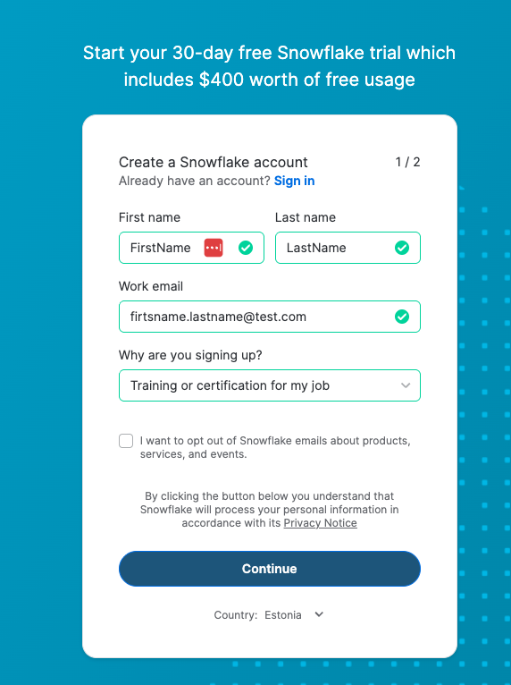
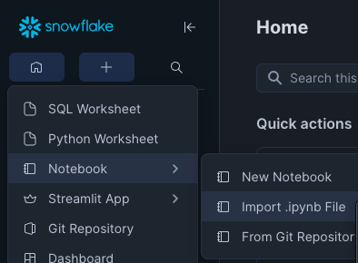

# Hands-on lab for Tallinn Data Week 

Welcome to this hands-on workshop, which is part of the [Tallinn Data Week](https://fienta.com/tallinn-data-week-2025-snowflake) program. The goal of this workshop is to give you practical experience with Snowflake by combining concepts from modern data engineering pipelines with elements of data processing using Modin and Cortex.

Before we start, please make sure you have a Snowflake trial account set up: https://signup.snowflake.com 

When signing up, select the cloud provider **AWS** and a region **EU (Frankfurt)**. This ensures faster performance and better alignment with the resources you’ll use in the workshop.

Once your account is ready, we will walk through how to import a Jupyter notebook directly in the Snowflake UI. You can also see the steps from here:

1. Download the [notebook](https://github.com/solita/tallinn-data-week-snowflake/blob/main/TDW_SNOWFLAKEDATAENGINEERING.ipynb)
2. Log in to your Snowflake UI.
3. Click the + Create button on the left sidebar.
4. Choose Notebook → Import .ipynb File

5. For database, select SNOWFLAKE_LEARNING_DB.
6. For schema, select PUBLIC.
7. Keep the runtime and runtime warehouse as the default.
8. Keep query warehouse as COMPUTE_WH and notebook warehouse as SYSTEM$STREAMLIT_NOTEBOOK_WH.
9. Finally, click Create to import the notebook into your environment.

The notebook will contain step-by-step instructions, this will allow you to follow along with the exercises and run the queries on your own environment.

## What This Workshop Covers

1. Data Engineering Foundations
- How to set up stages and file formats.
- Loading raw CSV data into Snowflake tables.
- Transforming and cleaning the data with SQL and views.
- Doing analytical queries
2. Extending with Modin and Cortex
- Applying Cortex features to enrich the dataset. It covers:
  - Classification function
  - Translation function
  - Summarisation function
  - Sentiment Analysis
- Using the GET_LINEAGE function to understand data dependencies and flows.
- Building a simple Streamlit app to demonstrate your results.
